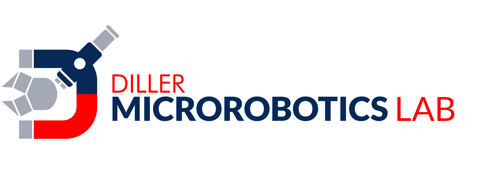

# Hello!
I am a MASc Candidate in Mechanical Engineering at the University of Toronto. My current research focuses on surgical applications of continuum robotics with magnetic mechanisms.

My research groups:

[Contact Me](mailto:ewalsh[at]mie.utoronto.ca)
